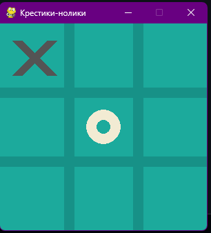

# 🎮 Крестики-нолики


Классическая игра "Крестики-нолики" с графическим интерфейсом, написанная на Python с использованием библиотеки Pygame.



## ✨ Особенности

- 🎯 Графический интерфейс
- 🖱️ Управление мышью
- 🏆 Отображение победителя
- 🔄 Возможность начать новую игру
- 💾 Сохранение результатов в файл

## 🚀 Установка и запуск

### Требования
- Python 3.7 или выше
- Pygame 2.5.2

### Установка зависимостей

```bash
pip install -r requirements.txt
```

### Запуск игры

```bash
python game.py
```

## 🎮 Как играть

1. **Начало игры**: Игра автоматически запускается с пустым полем
2. **Ходы**: Кликайте мышью по пустым ячейкам для размещения X или O
3. **Правила**: 
   - Игроки ходят по очереди
   - X всегда ходит первым
   - Побеждает тот, кто первым выстроит 3 символа в ряд (по горизонтали, вертикали или диагонали)
4. **Результат**: После окончания игры отображается победитель и кнопка "Новая игра"
5. **Повтор**: Нажмите "Новая игра" для начала новой партии

## 📁 Структура проекта

```
tic_tac_toe/
├── game.py              # Основной файл игры
├── gameparts/           # Модули игровой логики
│   ├── __init__.py
│   ├── parts.py         # Класс игрового поля
│   └── exceptions.py
├── screens/             # Скриншоты
│   └── gameplay.png
├── requirements.txt     # Зависимости
└── README.md           # Этот файл
```

## 🛠️ Технические детали

- **Размер поля**: 3x3 клетки
- **Размер окна**: 300x300 пикселей
- **Цветовая схема**: 
  - Фон: бирюзовый (28, 170, 156)
  - Линии: темно-бирюзовый (23, 145, 135)
  - X: серый (84, 84, 84)
  - O: бежевый (242, 235, 211)

## 📝 Результаты

Результаты всех игр автоматически сохраняются в файл `result.txt` в формате:
```
Победили X!
Ничья!
Победили O!
```

## 📄 Лицензия

Этот проект создан в образовательных целях.

---

## 👨‍💻 Автор

**Евгений Сульжицкий** - [GitHub](https://github.com/QSnock)

### 🔗 Ссылки
- [VK](https://vk.com/idholleyyt)
- [YouTube](https://youtube.com/@QSnock)

---

⭐ Если вам понравился проект, поставьте звездочку!

**Приятной игры! 🎮**
